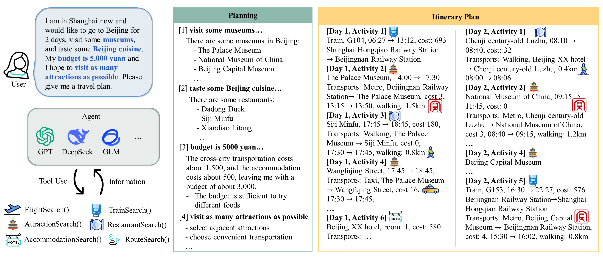

<center>
  <h1>ChinaTravel: A Real-World Benchmark for Language Agents in Chinese Travel Planning
</h1>
</center>

Official codebase for the paper "ChinaTravel: A Real-World Benchmark for Language Agents in Chinese Travel Planning".

| [Webpage](https://www.lamda.nju.edu.cn/shaojj/chinatravel/) | [Paper](https://arxiv.org/abs/2412.13682) | [Dataset(Huggingface)](https://huggingface.co/datasets/LAMDA-NeSy/ChinaTravel), [Dataset(ModelScope)](https://www.modelscope.cn/datasets/Cbphcr/ChinaTravel) |

<!-- 
 -->

## Quick Start

### Setup

1. Create a conda environment and install dependencies:

```bash
conda create -n chinatravel python=3.9  
conda activate chinatravel  
pip install -r requirements.txt  
```

2. Download the database and unzip it to the `chinatravel/environment/` directory (Download Links: [Google Drive](https://drive.google.com/drive/folders/1bJ7jA5cfExO_NKxKfi9qgcxEbkYeSdAU?usp=drive_link), [NJU Drive](https://box.nju.edu.cn/d/dd83e5a4a9e242ed8eb4/)).

3. Download necessary models or tokenizers (e.g. [deepseek tokenizer](https://cdn.deepseek.com/api-docs/deepseek_v3_tokenizer.zip)) to `./chinatravel/local_llm` (You need to create the folder first)


### Running

We support the deepseek (offical API from deepseek), gpt-4o (chatgpt-4o-latest), glm4-plus, and local inferences with Qwen, Mistral, Llama.

```bash
export OPENAI_API_KEY=""

# Act ReAct0 ReAct agent
python run_exp.py --splits easy --agent Act --llm gpt-4o # Replace "Act" with "ReAct0" or "ReAct" for other pure neural agents

# LLM-modulo agent with 10 refine_steps
python run_exp.py --splits medium --agent LLM-modulo --llm gpt-4o --refine_steps 10

# LLMNesy agent with oracle translation
python run_exp.py --splits human --agent LLMNeSy --llm deepseek --oracle_translation

# LLMNesy agent
python run_exp.py --splits human1000 --agent LLMNeSy --llm deepseek 
```

Note: 
1. Please download the weights of the open-source model to `./chinatravel/open_source_llm` and modify the corresponding model path in `./chinatravel/agent/llms.py` (This step is only necessary when using a locally deployed open-source model.).
2. We implemented the following agents:
   1. `Act`: zero-shot Act agent
   2. `ReAct0`: zero-shot ReAct agent
   3. `ReAct`: one-shot ReAct agent
   4. `LLM-modulo`: LLM-modulo agent
   5. `LLMNesy`: Neuro-Symbolic agent
3. The `LLM-modulo` agent and the `LLMNesy agent with oracle translation` require labeled information, so they cannot be run on `human1000`.
4. If you want to skip the completed queries, please add the parameter `--skip 1`
### Evaluation

```bash
python eval_exp.py --splits human --method LLMNeSy_deepseek_oracletranslation
python eval_exp.py --splits human --method LLMNeSy_deepseek
```

## Docs

[Environment](chinatravel/environment/readme.md)
[Constraints](chinatravel/symbol_verification/readme.md)
